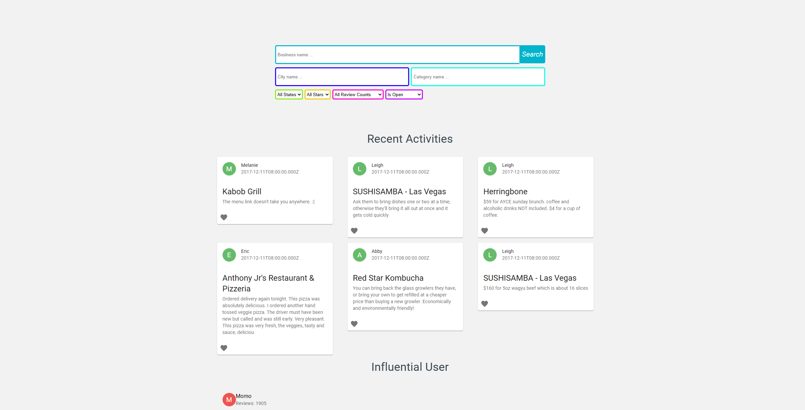
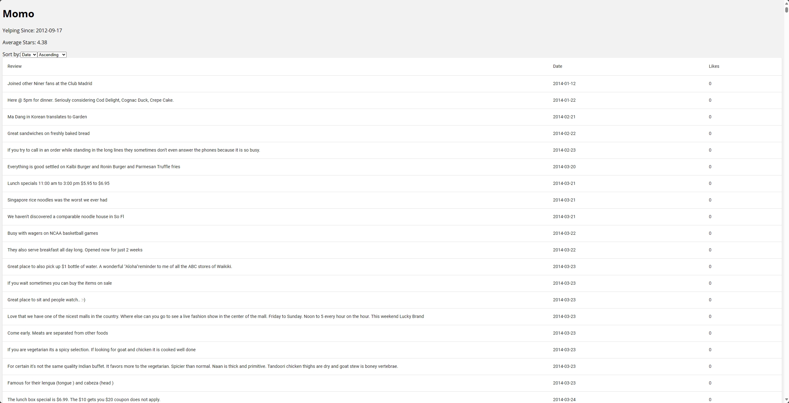
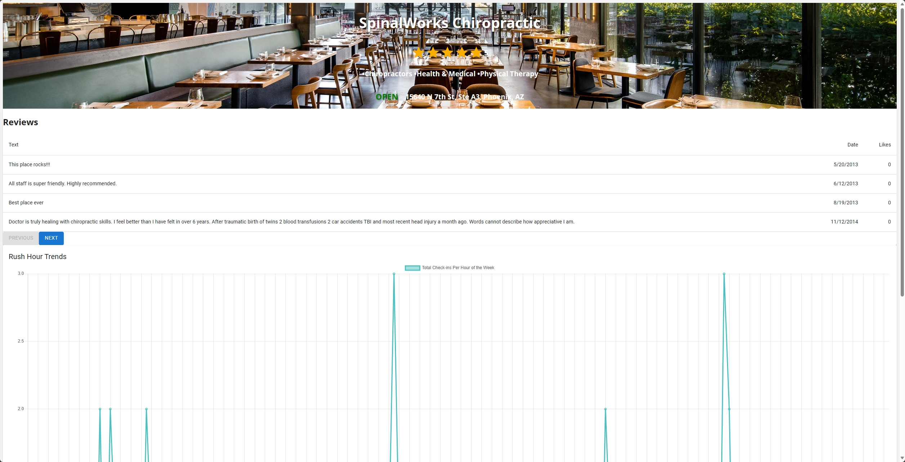

# Mini Yelp Project

## Group Member
Haitian Zhou, Jiakun Xiang, Runjie Zhao, Yujia Xu

## Description
A Yelp-like business reviews and recommendation web application, where the user can search for their desired restaurant, hotel, shopping, entertainment or other business facilities by various parameters like category, rating, popularity, distance, etc.

## Instruction
1. ```git clone``` current repo to a local folder.
2. create two local terminals where on is inside ```server``` folder while another one is inside ```client``` folder.
3. type ```npm install``` in both terminals.
4. run ```npm start``` in server terminal and then run ```npm start``` in client terminal.
5. if you want to do automated unit test on the backend(server side), run command ```npm test -- app.test.js``` in server terminal.

## Code Structure
.gitignore <br />
| data <br />
----| raw_data <br />
-------- hotel_review.csv<br />
-------- yelp_business.csv<br />
-------- yelp_checkin.csv<br />
-------- yelp_tip.checkin.csv<br />
-------- yelp_tip.csv<br />
-------- yelp_user.csv<br />
----| cleaned_data<br />
| preprocess<br />
---- preprocess_yelp_user.py<br />
---- preprocess_yelp_tip.py<br />
---- preprocess_yelp_business.py<br />
---- preprocess_yelp_checkin.py<br />
---- test.py<br />
| server<br />
---- package-lock.json<br />
---- package.json<br />
---- .gitignore<br />
---- routes.js<br />
---- server.js<br />

## Page Views

1. Main Page
<br />

2. User Review Page
<br />

3. Search Result Page
<br />

4. Business Page
<br />